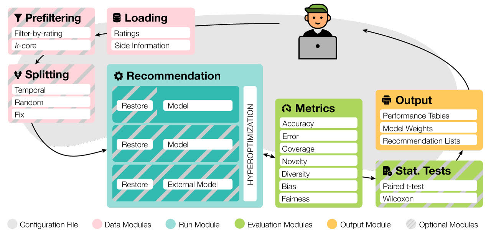

# ELLIOT

 [](https://github.com/sisinflab/elliot)  

[Docs] | [Paper]

[Docs]: https://elliot.readthedocs.io/en/latest/

[Paper]: https://elliot.readthedocs.io/en/latest/

Elliot is a comprehensive recommendation framework that analyzes the recommendation problem from the researcher's perspective.
It conducts a whole experiment, from dataset loading to results gathering.
The core idea is to feed the system with a simple and straightforward configuration file that drives the framework 
through the experimental setting choices.
Elliot untangles the complexity of combining splitting strategies, hyperparameter model optimization, model training, 
and the generation of reports of the experimental results.



The framework loads, filters, and splits the data considering a vast set of strategies (splitting methods and filtering 
approaches, from temporal training-test splitting to nested K-folds Cross-Validation).
Elliot optimizes hyperparameters for several recommendation algorithms, selects the best models, compares them with the 
baselines providing intra-model statistics, computes metrics spanning from accuracy to beyond-accuracy, bias, and fairness, 
and conducts statistical analysis (Wilcoxon and Paired t-test).

Elliot aims to keep the entire experiment reproducible and put the user in control of the framework.

## Installation
Elliot works with the following operating systems:

* Linux
* Windows 10
* macOS X

Elliot requires Python version 3.6 or later.

Elliot requires tensorflow version 2.3.2 or later. If you want to use Elliot with GPU,
please ensure that CUDA or cudatoolkit version is 7.6 or later.
This requires NVIDIA driver version >= 10.1 (for Linux and Windows10).

[comment]: <> (### Install from conda)

[comment]: <> (```bash)

[comment]: <> (conda install -c aibox recbole)

[comment]: <> (```)

[comment]: <> (### Install from pip)

[comment]: <> (```bash)

[comment]: <> (pip install recbole)

[comment]: <> (```)

### Install from source

#### CONDA
```bash
git clone https://github.com//sisinflab/elliot.git && cd elliot
conda create --name elliot_env python=3.8
conda activate
pip install --upgrade pip
pip install -e . --verbose
```

#### VIRTUALENV
```bash
git clone https://github.com//sisinflab/elliot.git && cd elliot
virtualenv -p /usr/bin/pyhton3.6 venv # your python location and version
source venv/bin/activate
pip install --upgrade pip
pip install -e . --verbose
```

## Quick Start

Elliot's entry point is the function `run_experiment`, which accepts a configuration file that drives the whole experiment. 
In the following, a sample configuration file is shown to demonstrate how a sample and explicit structure can generate a rigorous experiment.

```python
from elliot.run import run_experiment

run_experiment("configuration/file/path")
```

The following file is a simple configuration for an experimental setup. It contains all the instructions to get 
the MovieLens-1M catalog from a specific path and perform a train test split in a random sample way with a ratio of 20%.

This experiment provides a hyperparameter optimization with a grid search strategy for an Item-KNN model. Indeed, 
it is seen that the possible values of neighbors are closed in squared brackets. It indicates that two different models 
equipped with two different neighbors' values will be trained and compared to select the best configuration. Moreover, 
this configuration obliges Elliot to save the recommendation lists with at most 10 items per user as suggest by top_k property.

In this basic experiment, only a simple metric is considered in the final evaluation study. The candidate metric is nDCG 
for a cutoff equal to top_k, unless otherwise noted.

```yaml
experiment:
  dataset: movielens_1m
  data_config:
    strategy: dataset
    dataset_path: ../data/movielens_1m/dataset.tsv
    splitting:
      test_splitting:
        strategy: random_subsampling
        test_ratio: 0.2
    models:
      ItemKNN:
        meta:
          hyper_opt_alg: grid
          save_recs: True
        neighbors: [50, 100]
        similarity: cosine
    evaluation:
      simple_metrics: [nDCG]
    top_k: 10
```

## Contributing

There are many ways to contribute to Elliot! You can contribute code, make improvements to the documentation, report or investigate [bugs and issues](https://github.com/sisinflab/elliot/issues)

We welcome all contributions from bug fixes to new features and extensions.

Feel free to share with us your custom configuration files. We are creating a vault of reproducible experiments, and we would be glad of mentioning your contribution.

Reference Elliot in your blogs, papers, and articles.

Talk about Elliot on social media with the hashtag **#elliotrs**.

[comment]: <> (## Cite)

[comment]: <> (If you find RecBole useful for your research or development, please cite the following [paper]&#40;https://arxiv.org/abs/2011.01731&#41;:)

[comment]: <> (```)

[comment]: <> (@article{recbole,)

[comment]: <> (    title={RecBole: Towards a Unified, Comprehensive and Efficient Framework for Recommendation Algorithms},)

[comment]: <> (    author={Wayne Xin Zhao and Shanlei Mu and Yupeng Hou and Zihan Lin and Kaiyuan Li and Yushuo Chen and Yujie Lu and Hui Wang and Changxin Tian and Xingyu Pan and Yingqian Min and Zhichao Feng and Xinyan Fan and Xu Chen and Pengfei Wang and Wendi Ji and Yaliang Li and Xiaoling Wang and Ji-Rong Wen},)

[comment]: <> (    year={2020},)

[comment]: <> (    journal={arXiv preprint arXiv:2011.01731})

[comment]: <> (})

[comment]: <> (```)

## The Team
Elliot is developed by
* Vito Walter Anelli<sup id="a1">[*](#f1)</sup> (vitowalter.anelli@poliba.it)
* Alejandro Bellogín (alejandro.bellogin@uam.es)
* Tommaso Di Noia (tommaso.dinoia@poliba.it)
* Antonio Ferrara (antonio.ferrara@poliba.it)
* Daniele Malitesta (daniele.malitesta@poliba.it)
* Felice Antonio Merra (felice.merra@poliba.it)
* Claudio Pomo<sup id="a1">[*](#f1)</sup> (claudio.pomo@poliba.it)

It is maintained by [SisInfLab Group](http://sisinflab.poliba.it/) and [Information Retrieval Group](http://ir.ii.uam.es/).

<b id="f1"><sup>*</sup></b> Corresponding authors
## License
ELLIOT uses [APACHE2 License](./LICENSE).

## Acknowledgements

We refer to the following repositories to improve our code:

 - SliM and KNN-CF parts with [RecSys2019_DeepLearning_Evaluation](https://github.com/MaurizioFD/RecSys2019_DeepLearning_Evaluation)
